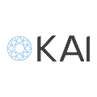

KAI means sea in Hawaiian, Japanese and Native American. Started in 2020 by three young programmers to make their mark in the workplace and individual lives.

We help organisations care for their employees' mental well-being, supporting them through grief, stress, anxiety, trauma and relationships. We enable them to take control of their lives allowing them to focus on what really matters on the job.
